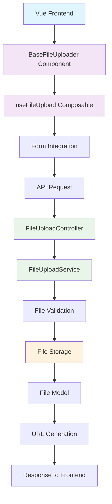

# Comprehensive File Upload System Guide

A complete standalone implementation guide for file upload functionality in Laravel + Vue.js applications. This guide provides everything you need to implement a robust, secure file upload system without relying on external packages.

## Table of Contents

-   [System Overview](#system-overview)
-   [Architecture](#architecture)
-   [Frontend Implementation](#frontend-implementation)
-   [Backend Implementation](#backend-implementation)
-   [Database Schema](#database-schema)
-   [Security Measures](#security-measures)
-   [Integration Examples](#integration-examples)
-   [Complete Code Examples](#complete-code-examples)

## System Overview

This file upload system provides:

-   **Drag-and-drop** file upload interface
-   **File validation** (type, size, format)
-   **Image preview** generation
-   **Multiple file** support
-   **Security features** (hash-based filenames, validation)
-   **Database tracking** of uploaded files
-   **URL generation** for stored files

## Architecture



## Frontend Implementation

### BaseFileUploader Component

**Location**: `resources/js/Components/Shared/Fields/BaseFileUploader.vue`

```vue
<template>
  <div class="file-uploader">
    <div
      ref="dropzoneRef"
      :class="[
        'file-uploader__dropzone',
        { 'file-uploader__dropzone--dragover': isDragOver },
        { 'file-uploader__dropzone--error': !!error },
        { 'file-uploader__dropzone--disabled': disabled }
      ]"
      @click="triggerFileInput"
    >
      <!-- Upload content -->
      <div class="file-uploader__content">
        <Upload class="file-uploader__icon" />
        <div class="file-uploader__text">
          <p class="file-uploader__label">
            {{ label }}
            <span v-if="required" class="text-destructive">*</span>
          </p>
          <p class="file-uploader__description">{{ description }}</p>
        </div>
      </div>

      <!-- File input -->
      <input
        ref="fileInput"
        type="file"
        :id="id"
        :accept="acceptString"
        :multiple="multiple"
        :disabled="disabled"
        class="file-uploader__input"
        @change="onFileChange"
      />
    </div>

    <!-- Preview area -->
    <div v-if="withPreview && previewUrl" class="file-uploader__preview">
      
      <button type="button" class="file-uploader__preview-remove" @click="removeFile">
        <X class="file-uploader__preview-remove-icon" />
      </button>
    </div>

    <!-- Error display -->
    <div v-if="validationErrors.length > 0" class="file-uploader__errors">
      <p
        v-for="(error, index) in validationErrors"
        :key="index"
        class="file-uploader__error"
      >
        {{ error.file }}: {{ error.error }}
      </p>
    </div>
    <p v-if="error" class="file-uploader__error">{{ error }}</p>
  </div>
</template>

<script setup lang="ts">
import { ref, computed, onMounted, watch } from 'vue';
import { useDropZone } from '@vueuse/core';
import { Upload, X } from 'lucide-vue-next';

interface FileData {
  file?: File;
  preview?: string;
  id?: number;
  url?: string;
}

interface Props {
  id?: string;
  label?: string;
  acceptTypes?: ('image' | 'video' | 'pdf' | 'xlsx' | 'csv')[];
  description?: string;
  maxSize?: number; // in MB
  multiple?: boolean;
  helper?: string;
  error?: string;
  disabled?: boolean;
  required?: boolean;
  withPreview?: boolean;
  modelValue?: FileData | FileData[] | null;
}

interface ValidationError {
  file: string;
  error: string;
}

const props = withDefaults(defineProps<Props>(), {
  acceptTypes: () => ['image'],
  description: 'Drag and drop files here or click to browse',
  maxSize: 2,
  multiple: false,
  withPreview: true,
});

const emit = defineEmits<{
  'update:modelValue': [value: FileData | FileData[] | null];
}>();

const fileInput = ref<HTMLInputElement>();
const isDragOver = ref(false);
const validationErrors = ref<ValidationError[]>([]);
const fileData = ref<FileData | FileData[] | null>(props.modelValue || null);

// Accept string for file input
const acceptString = computed(() => {
  const acceptMap: Record<string, string[]> = {
    image: ['image/*'],
    video: ['video/*'],
    pdf: ['.pdf', 'application/pdf'],
    xlsx: ['.xlsx', 'application/vnd.openxmlformats-officedocument.spreadsheetml.sheet'],
    csv: ['.csv', 'text/csv'],
  };

  return props.acceptTypes
    .flatMap(type => acceptMap[type] || [])
    .join(',');
});

// Preview URL for images
const previewUrl = computed(() => {
  if (Array.isArray(fileData.value)) {
    return fileData.value[0]?.preview || fileData.value[0]?.url;
  }
  return fileData.value?.preview || fileData.value?.url;
});

// Drag and drop handling
const { isOverDropZone } = useDropZone(fileInput, {
  onDrop: (files) => {
    isDragOver.value = false;
    if (files) {
      handleFiles(files);
    }
  },
  onEnter: () => {
    isDragOver.value = true;
  },
  onLeave: () => {
    isDragOver.value = false;
  },
});

// File validation
const isValidFileType = (file: File): boolean => {
  return props.acceptTypes.some((type) => {
    if (type === 'pdf') return file.type === 'application/pdf';
    if (type === 'xlsx') return file.type === 'application/vnd.openxmlformats-officedocument.spreadsheetml.sheet';
    if (type === 'csv') return file.type === 'text/csv';
    return file.type.startsWith(type);
  });
};

const isValidFileSize = (file: File): boolean => {
  return file.size <= props.maxSize * 1024 * 1024;
};

const validateFile = (file: File): ValidationError | null => {
  if (!isValidFileType(file)) {
    return { file: file.name, error: `Invalid file type. Allowed: ${props.acceptTypes.join(', ')}` };
  }
  if (!isValidFileSize(file)) {
    return { file: file.name, error: `File too large. Max size: ${props.maxSize}MB` };
  }
  return null;
};

// File handling
const handleFiles = (files: FileList | File[]) => {
  validationErrors.value = [];
  const fileArray = Array.from(files);
  const newFiles: FileData[] = [];

  for (const file of fileArray) {
    const error = validateFile(file);
    if (error) {
      validationErrors.value.push(error);
      continue;
    }

    const fileData: FileData = { file };

    // Generate preview for images
    if (file.type.startsWith('image/')) {
      const reader = new FileReader();
      reader.onload = (e) => {
        fileData.preview = e.target?.result as string;
        if (props.multiple) {
          const currentFiles = Array.isArray(fileData.value) ? fileData.value : [];
          fileData.value = [...currentFiles, fileData];
        } else {
          fileData.value = fileData;
        }
        emitUpdate();
      };
      reader.readAsDataURL(file);
    } else {
      newFiles.push(fileData);
    }
  }

  if (newFiles.length > 0) {
    if (props.multiple) {
      const currentFiles = Array.isArray(fileData.value) ? fileData.value : [];
      fileData.value = [...currentFiles, ...newFiles];
    } else {
      fileData.value = newFiles[0];
    }
    emitUpdate();
  }
};

const triggerFileInput = () => {
  if (!props.disabled) {
    fileInput.value?.click();
  }
};

const onFileChange = (event: Event) => {
  const input = event.target as HTMLInputElement;
  if (input.files && input.files.length > 0) {
    handleFiles(input.files);
    input.value = ''; // Reset input
  }
};

const removeFile = () => {
  fileData.value = null;
  validationErrors.value = [];
  emitUpdate();
};

const emitUpdate = () => {
  emit('update:modelValue', fileData.value);
};

// Watch for external modelValue changes
watch(() => props.modelValue, (newValue) => {
  fileData.value = newValue;
});

// Initialize with existing value
onMounted(() => {
  if (props.modelValue) {
    fileData.value = props.modelValue;
  }
});
</script>

<style scoped>
.file-uploader {
  @apply space-y-3;
}

.file-uploader__dropzone {
  @apply border-2 border-dashed border-gray-300 rounded-lg p-6 text-center cursor-pointer transition-colors hover:border-gray-400;
}

.file-uploader__dropzone--dragover {
  @apply border-primary bg-primary/5;
}

.file-uploader__dropzone--error {
  @apply border-destructive;
}

.file-uploader__dropzone--disabled {
  @apply opacity-50 cursor-not-allowed;
}

.file-uploader__content {
  @apply flex flex-col items-center space-y-2;
}

.file-uploader__icon {
  @apply size-8 text-gray-400;
}

.file-uploader__label {
  @
```

### Routes Configuration

**Location**: `routes/api.php`

```php
<?php

use App\Http\Controllers\FileUploadController;
use Illuminate\Support\Facades\Route;

Route::prefix('upload')->name('upload.')->group(function () {
    Route::post('/', [FileUploadController::class, 'upload'])->name('single');
    Route::post('/multiple', [FileUploadController::class, 'uploadMultiple'])->name('multiple');
    Route::get('/{file}', [FileUploadController::class, 'show'])->name('show');
    Route::delete('/{file}', [FileUploadController::class, 'destroy'])->name('destroy');
});

// Optional: Admin routes with authentication
Route::middleware(['auth:sanctum'])->prefix('admin/upload')->name('admin.upload.')->group(function () {
    Route::post('/', [FileUploadController::class, 'upload'])->name('single');
    Route::post('/multiple', [FileUploadController::class, 'uploadMultiple'])->name('multiple');
    Route::delete('/{file}', [FileUploadController::class, 'destroy'])->name('destroy');
});
```

## Security Measures

### Validation Service

**Location**: `app/Services/FileValidationService.php`

```php
<?php

namespace App\Services;

use Illuminate\Http\UploadedFile;
use Illuminate\Support\Facades\Validator;

class FileValidationService
{
    protected array $mimeTypeMap = [
        'image' => [
            'jpeg' => 'image/jpeg',
            'png' => 'image/png',
            'jpg' => 'image/jpeg',
            'gif' => 'image/gif',
            'svg' => 'image/svg+xml',
            'webp' => 'image/webp',
        ],
        'video' => [
            'mp4' => 'video/mp4',
            'mov' => 'video/quicktime',
            'avi' => 'video/x-msvideo',
            'wmv' => 'video/x-ms-wmv',
        ],
        'pdf' => [
            'pdf' => 'application/pdf',
        ],
        'xlsx' => [
            'xlsx' => 'application/vnd.openxmlformats-officedocument.spreadsheetml.sheet',
            'xls' => 'application/vnd.ms-excel',
        ],
        'csv' => [
            'csv' => 'text/csv',
        ],
    ];

    public function validate(UploadedFile $file, string $type, ?int $maxSize = null): array
    {
        $rules = $this->getValidationRules($type, $maxSize);
        $validator = Validator::make(['file' => $file], ['file' => $rules]);

        if ($validator->fails()) {
            return [
                'valid' => false,
                'errors' => $validator->errors()->all(),
            ];
        }

        // Additional security checks
        if (!$this->isSafeFile($file)) {
            return [
                'valid' => false,
                'errors' => ['File type is not allowed for security reasons'],
            ];
        }

        return ['valid' => true, 'errors' => []];
    }

    public function getValidationRules(string $type, ?int $maxSize = null): array
    {
        $rules = [
            'image' => ['image', 'mimes:jpeg,png,jpg,gif,svg,webp'],
            'video' => ['mimes:mp4,mov,avi,wmv'],
            'pdf' => ['mimes:pdf'],
            'xlsx' => ['mimes:xlsx,xls'],
            'csv' => ['mimes:csv'],
        ];

        $typeRules = $rules[$type] ?? ['file'];

        if ($maxSize) {
            $typeRules[] = 'max:' . ($maxSize * 1024);
        }

        return $typeRules;
    }

    protected function isSafeFile(UploadedFile $file): bool
    {
        $mimeType = $file->getMimeType();
        $extension = strtolower($file->getClientOriginalExtension());

        // Check if extension matches MIME type
        foreach ($this->mimeTypeMap as $type => $extensions) {
            if (isset($extensions[$extension]) && $extensions[$extension] === $mimeType) {
                return true;
            }
        }

        return false;
    }

    public function getMaxSizeForType(string $type): int
    {
        return match($type) {
            'image' => 2048, // 2MB
            'video' => 5120, // 5MB
            'pdf' => 1024,   // 1MB
            'xlsx' => 2048,  // 2MB
            'csv' => 1024,   // 1MB
            default => 5120, // 5MB
        };
    }
}
```

### Security Middleware

**Location**: `app/Http/Middleware/ValidateFileUpload.php`

```php
<?php

namespace App\Http\Middleware;

use Closure;
use Illuminate\Http\Request;
use Symfony\Component\HttpFoundation\Response;

class ValidateFileUpload
{
    public function handle(Request $request, Closure $next): Response
    {
        if ($request->hasFile('file')) {
            $file = $request->file('file');

            // Basic security checks
            if (!$this->isValidFile($file)) {
                return response()->json([
                    'error' => 'Invalid file upload',
                ], 422);
            }

            // Check file size limits
            if ($file->getSize() > 10 * 1024 * 1024) { // 10MB max
                return response()->json([
                    'error' => 'File too large',
                ], 422);
            }
        }

        return $next($request);
    }

    protected function isValidFile($file): bool
    {
        if (!$file->isValid()) {
            return false;
        }

        // Check for executable files
        $forbiddenExtensions = ['php', 'exe', 'js', 'py', 'sh', 'bat', 'cmd'];
        $extension = strtolower($file->getClientOriginalExtension());

        if (in_array($extension, $forbiddenExtensions)) {
            return false;
        }

        return true;
    }
}
```

## Integration Examples

### Form Integration Example

**Location**: `resources/js/Pages/ExampleForm.vue`

```vue
<template>
    <form @submit.prevent="submitForm">
        <!-- Basic file upload -->
        <BaseFileUploader
            v-model="form.avatar_file"
            label="Profile Avatar"
            :accept-types="['image']"
            :max-size="2"
            :with-preview="true"
            :error="form.errors.avatar_file"
        />

        <!-- Multiple files -->
        <BaseFileUploader
            v-model="form.documents"
            label="Supporting Documents"
            :accept-types="['pdf', 'xlsx', 'csv']"
            :multiple="true"
            :max-size="5"
            :error="form.errors.documents"
        />

        <!-- Refund proof example -->
        <BaseFileUploader
            v-model="refundForm.proof"
            label="Refund Proof"
            :accept-types="['image', 'pdf']"
            description="Upload images or PDF documents as proof"
            :max-size="3"
            :error="refundForm.errors.proof"
        />

        <button type="submit" :disabled="form.processing">Submit Form</button>
    </form>
</template>

<script setup lang="ts">
import { ref } from "vue";
import { useForm } from "@inertiajs/vue3";
import BaseFileUploader from "@/Components/Shared/Fields/BaseFileUploader.vue";

const form = useForm({
    avatar_file: null,
    documents: [],
    // ... other form fields
});

const refundForm = useForm({
    proof: null,
    // ... other refund fields
});

const submitForm = async () => {
    // Handle file uploads in form submission
    const formData = new FormData();

    // Append regular form fields
    Object.keys(form.data()).forEach((key) => {
        if (key !== "avatar_file" && key !== "documents") {
            formData.append(key, form[key]);
        }
    });

    // Handle file uploads
    if (form.avatar_file?.file) {
        formData.append("avatar", form.avatar_file.file);
    }

    if (Array.isArray(form.documents)) {
        form.documents.forEach((doc, index) => {
            if (doc.file) {
                formData.append(`documents[${index}]`, doc.file);
            }
        });
    }

    form.post("/submit-form", {
        data: formData,
        onSuccess: () => {
            // Handle success
        },
        onError: (errors) => {
            // Handle errors
        },
    });
};
</script>
```

### useFileUpload Integration

**Location**: `resources/js/Pages/Admin/ContentForm.vue`

```vue
<template>
    <form @submit.prevent="submit">
        <!-- Using useFileUpload composable -->
        <BaseFileUploader
            :model-value="form.background_image_file"
            @update:model-value="handleBackgroundImageUpload"
            :path="form.background_image"
            label="Background Image"
            :accept-types="['image']"
            :error="form.errors.background_image_file"
        />

        <BaseFileUploader
            :model-value="form.featured_image_file"
            @update:model-value="handleFeaturedImageUpload"
            :path="form.featured_image"
            label="Featured Image"
            :accept-types="['image']"
            :error="form.errors.featured_image_file"
        />

        <button type="submit">Save</button>
    </form>
</template>

<script setup lang="ts">
import { onMounted } from "vue";
import { useForm } from "@inertiajs/vue3";
import { useFileUpload } from "@/Composables/useFileUpload";
import BaseFileUploader from "@/Components/Shared/Fields/BaseFileUploader.vue";

const form = useForm({
    title: "",
    background_image: "",
    background_image_file: null,
    featured_image: "",
    featured_image_file: null,
});

// Initialize file upload handlers
const {
    handleFileUpload: handleBackgroundImageUpload,
    initializeFileField: initBackgroundImage,
} = useFileUpload(form, "background_image", "background_image_file");

const {
    handleFileUpload: handleFeaturedImageUpload,
    initializeFileField: initFeaturedImage,
} = useFileUpload(form, "featured_image", "featured_image_file");

// Initialize existing files
onMounted(() => {
    initBackgroundImage();
    initFeaturedImage();
});

const submit = () => {
    form.post("/admin/content", {
        onSuccess: () => {
            // Reset file fields after successful submission
            form.background_image_file = null;
            form.featured_image_file = null;
        },
    });
};
</script>
```

### Backend Form Request Handling

**Location**: `app/Http/Requests/ContentRequest.php`

```php
<?php

namespace App\Http\Requests;

use Illuminate\Foundation\Http\FormRequest;
use Illuminate\Validation\Rules\File;

class ContentRequest extends FormRequest
{
    public function authorize(): bool
    {
        return true;
    }

    public function rules(): array
    {
        return [
            'title' => 'required|string|max:255',
            'background_image' => 'sometimes|string',
            'background_image_file' => [
                'sometimes',
                'nullable',
                File::image()
                    ->max(2048) // 2MB
                    ->dimensions
```

                    ->dimensions(Rule::dimensions()->maxWidth(2000)->maxHeight(2000)),
            ],
            'featured_image' => 'sometimes|string',
            'featured_image_file' => [
                'sometimes',
                'nullable',
                File::image()
                    ->max(1024) // 1MB
                    ->dimensions(Rule::dimensions()->maxWidth(1200)->maxHeight(800)),
            ],
        ];
    }

    public function messages(): array
    {
        return [
            'background_image_file.image' => 'The background image must be a valid image file',
            'background_image_file.max' => 'The background image must not exceed 2MB',
            'featured_image_file.image' => 'The featured image must be a valid image file',
            'featured_image_file.max' => 'The featured image must not exceed 1MB',
        ];
    }

}

````

## Best Practices & Security Measures

### 1. File Validation
- **Always validate on both frontend and backend**
- **Use MIME type validation** instead of relying on file extensions
- **Implement size limits** appropriate for each file type
- **Use hash-based filenames** to prevent filename conflicts and attacks

### 2. Storage Configuration
```php
// config/filesystems.php
'disks' => [
    'uploads' => [
        'driver' => 'local',
        'root' => storage_path('app/uploads'),
        'url' => env('APP_URL') . '/uploads',
        'visibility' => 'private', // More secure than public
        'throw' => false,
    ],
],
````

### 3. Security Headers

```nginx
# Nginx configuration for uploads directory
location /uploads/ {
    # Prevent execution of uploaded files
    location ~ \.(php|exe|js|py|sh|bat|cmd)$ {
        deny all;
        return 403;
    }

    # Security headers
    add_header X-Content-Type-Options "nosniff";
    add_header X-Frame-Options "DENY";
    add_header X-XSS-Protection "1; mode=block";

    # Cache control
    expires 6M;
    access_log off;
}
```

### 4. Regular Maintenance

```php
// app/Console/Commands/CleanupUploads.php
public function handle()
{
    // Delete files older than 30 days
    $threshold = now()->subDays(30);

    UploadedFile::where('created_at', '<', $threshold)
        ->whereDoesntHave('relatedModels') // Keep files that are in use
        ->chunk(100, function ($files) {
            foreach ($files as $file) {
                $file->delete(); // This will also delete the physical file
            }
        });
}
```

## Complete Setup Instructions

### 1. Installation Steps

```bash
# Run migration
php artisan migrate

# Create storage link
php artisan storage:link

# Optional: Publish configuration
php artisan vendor:publish --tag=upload-config
```

### 2. Frontend Setup

```bash
# Install VueUse for drag-and-drop
npm install @vueuse/core

# Install Lucide icons
npm install lucide-vue-next
```

### 3. Environment Configuration

```env
# File upload settings
UPLOAD_DISK=public
UPLOAD_MAX_SIZE=5120
UPLOAD_ALLOWED_TYPES=image/*,video/*,application/pdf

# S3 Configuration (optional)
AWS_ACCESS_KEY_ID=
AWS_SECRET_ACCESS_KEY=
AWS_DEFAULT_REGION=
AWS_BUCKET=
AWS_URL=
```

## Troubleshooting

### Common Issues

1. **File size too large**

    - Check `upload_max_filesize` and `post_max_size` in php.ini
    - Update Nginx/Apache client_max_body_size

2. **Permission errors**

    - Ensure storage directory is writable: `chmod -R 775 storage`
    - Check disk configuration in filesystems.php

3. **URL generation issues**

    - Verify APP_URL in .env file
    - Check storage link: `php artisan storage:link`

4. **Validation errors**
    - Ensure both frontend and backend validation rules match
    - Check MIME type detection

## Performance Optimization

### 1. Image Optimization

```php
// Use intervention/image for image processing
public function storeWithOptimization(HttpUploadedFile $file, string $folder): UploadedFile
{
    $image = Image::make($file->getRealPath());

    // Optimize image
    $image->resize(1200, null, function ($constraint) {
        $constraint->aspectRatio();
        $constraint->upsize();
    })->encode('webp', 80);

    // Save optimized image
    $optimizedPath = // ... save logic

    return $this->createFileRecord($optimizedPath, $file, $folder);
}
```

### 2. CDN Integration

```php
// Use CDN for file URLs
public function getUrlAttribute($value): string
{
    if ($this->disk === 's3' && env('CDN_URL')) {
        return str_replace(
            env('AWS_URL'),
            env('CDN_URL'),
            $value
        );
    }

    return $value;
}
```

### 3. Chunked Uploads

For large files, implement chunked uploads using libraries like:

-   `vue-chunked-upload` for frontend
-   `pion/laravel-chunk-upload` for backend

## Conclusion

This comprehensive file upload system provides:

-   ✅ **Complete frontend component** with drag-and-drop
-   ✅ **Robust backend service** with validation
-   ✅ **Database tracking** of all uploaded files
-   ✅ **Security measures** against common vulnerabilities
-   ✅ **Performance optimizations** for production use
-   ✅ **Easy integration** with existing forms

The system is completely standalone and can be implemented in any Laravel + Vue.js project without external dependencies.

## License

This implementation is open source and can be used in any project. Always ensure proper security testing before deployment to production.

---

_Last updated: September 2024_
_Version: 1.0.0_
