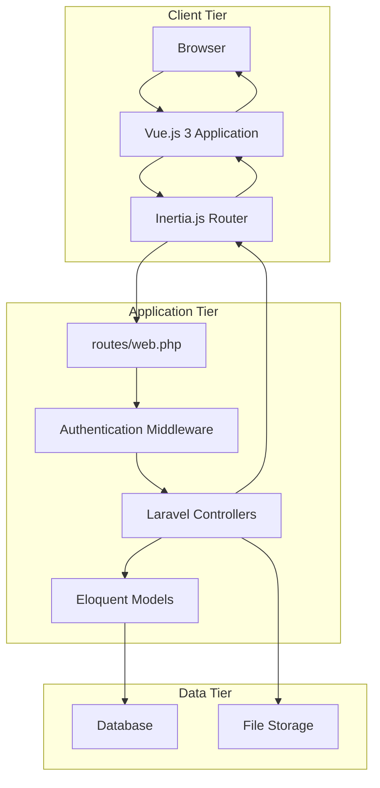
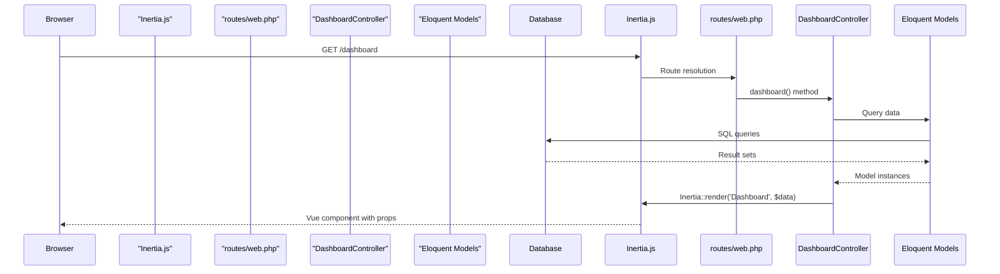
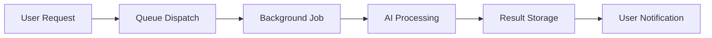

## Project Overview
This project is an internal dashboard for Hidden Treasures, a sports card consignment business.  The main goals are to streamline operations, improve data visualization, and enhance workflow management through AI-assisted features.  Key use cases include optimizing item intake, pricing, listing, sales, and payout reconciliation.  The target audience includes administrators, managers, virtual assistants, and consignors, with role-based access control. 

## Architecture & Structure

### High-level Architecture Overview
The Hidden Treasures Dashboard uses a modern three-tier web application architecture.  It consists of a Client Tier (Browser, Vue.js 3 Application, Inertia.js Router), an Application Tier (Laravel Controllers, Middleware, Eloquent Models), and a Data Tier (Database, File Storage). 

### Key Directories and Their Purposes
The application follows Laravel conventions with Vue.js components organized by functionality. 
- `app/Http/Controllers/`: Contains Laravel controllers like `DashboardController`, `TaskController`, and `ContentPostController`. 
- `app/Models/`: Houses Eloquent models such as `User`, `Task`, `ContentPost`, `Sales`, `Expense`, and `Goal`. 
- `routes/`: Defines application routing, including `web.php` and `auth.php`. 
- `resources/js/Components/`: Stores reusable Vue.js components, including dashboard modules and UI components. 
- `resources/js/Pages/`: Contains Inertia.js page components, which are the main application views. 
- `resources/css/`: Holds styling assets, including TailwindCSS configuration and custom styles. 
- `public/`: Contains public assets like compiled assets and uploaded files. 

### Main Components and How They Interact
The system organizes functionality around distinct business domains, each with dedicated controllers handling CRUD operations and specialized business logic.  For example, `TaskController` interacts with `TaskModel`, and `ContentPostController` interacts with `ContentPostModel` and `ContentPostMediaModel`. 

### Data Flow and System Design
The application uses Inertia.js to provide a single-page application experience by passing data directly from Laravel controllers to Vue.js components. 

AI operations are processed asynchronously using Laravel's queue system. 

## Development Setup

### Prerequisites and Dependencies
The backend requires Laravel 12.x and PHP 8.2+.  The frontend uses Vue.js 3.4.x with Inertia.js.  Styling is handled by Tailwind CSS 3.2.x.  The database is MySQL with Eloquent ORM.  Vite 7.x is used as the build tool. 

### How to run the project locally
The codebase context does not explicitly detail installation steps or environment configuration. However, it mentions development tools like Composer for PHP dependencies and NPM for JavaScript dependencies.  It also refers to Artisan commands like `serve` and `queue:listen`. 

## Code Organization

### Coding Standards and Conventions
The codebase uses PascalCase for component names (e.g., `MetricCard.vue`), camelCase for composables (e.g., `useDashboardData.js`), kebab-case for utilities (e.g., `format-currency.js`), and SCREAMING_SNAKE_CASE for constants (e.g., `DASHBOARD_MODULES.js`). 

### Import/Export Patterns
Imports are organized with Vue imports first, followed by third-party imports, then internal components (alphabetical), and finally utilities, composables, constants, and types. 

### Component Structure
Vue components follow a template structure including `<template>`, `<script setup>`, and `<style scoped>`.  Inside `<script setup>`, props are defined using `defineProps`, emits with `defineEmits`, reactive state with `ref`, computed properties with `computed`, methods, and lifecycle hooks like `onMounted`. 

## Key Features & Implementation

### Main Features and How They're Implemented
The dashboard includes modules for Tasks, Sales, Goals, Expenses, and Content. 
- **AI Price Suggester**: Provides automated pricing recommendations using comparable sales data from eBay Finding API and CardLadder API, with confidence scoring. 
- **AI Description Generator**: Automates product description generation with templated content and SEO optimization using OpenAI API. 
- **AI Summary Panel**: Offers automated "what changed and why" explanations for KPIs and business metrics. 
- **Risk and Anomaly Detection**: Identifies high-risk listings and orders, and negative margin orders, leading to automatic task creation.  
- **Auto-Tagging System**: Automatically categorizes and tags items using OCR and AI models. 

### API Endpoints
The application uses RESTful endpoints with Sanctum authentication for the backend.  Specialized dashboard API routes exist for real-time data fetching, such as `/api/dashboard/daily-summary` and `/api/dashboard/sales-metrics`. 

### Database Schema
The current schema includes tables for `Users`, `Sales`, `Tasks`, `Content`, `Expenses`, and `Goals`.  New models like `Item` for inventory tracking and `Comp` for comparable sales data are planned. 

## Testing Strategy

### Testing Frameworks Used
PHPUnit is used for backend testing, and Vue Test Utils for frontend testing. 

### Test File Organization
Frontend tests for components are typically found in `tests/Components/`. 

### How to run tests
The codebase context does not explicitly state how to run tests, but the presence of PHPUnit and Vue Test Utils implies standard commands for these frameworks would be used. 

### Testing Best Practices in this codebase
The codebase includes snapshot tests for KPI queries using fixed fixtures and synthetic data seeders to simulate intake/sales.  Error tracking with Sentry and slow query logs are also mentioned. 

## Build & Deployment

### Build Process and Scripts
Vite 7.x is used for optimized asset compilation on the frontend. 

### Deployment Configuration
The application is deployed on Hostinger shared hosting with SQLite. 

### CI/CD pipeline (if exists)
The codebase context does not provide information about a CI/CD pipeline. <cite />

## Git Workflow
The codebase uses Git with a structured branching strategy.  No further details on branching strategy, commit message conventions, code review, or release process are available in the provided context. <cite />

## Common Patterns & Best Practices

### Recurring code patterns
The frontend uses an Atomic Design Pattern for component architecture, categorizing components into Atoms, Molecules, Organisms, Templates, and Pages. 

### Error handling approach
The AI service base class is planned to include error handling and rate limiting.  Fallback strategies for AI features include manual pricing workflows, cached comparable data for API outages, and human oversight. 

### Logging and monitoring
Error tracking (Sentry) and slow query logs are implemented.  Performance monitoring setup is a long-term consideration. 

### Performance considerations
Performance strategies include Redis caching, background processing, database indexing, and API call optimization.  Scalability measures involve multiple queue workers, load balancing, database partitioning, and CDN integration. <cite repo="jdbernardo16/

# Development Partnership and How We Should Partner

We build production code together. I handle implementation details while you guide architecture and catch complexity early.

## Core Workflow: Research → Plan → Implement → Validate

**Start every feature with:** "Let me research the codebase and create a plan before implementing."

1. **Research** - Understand existing patterns and architecture
2. **Plan** - Propose approach and verify with you
3. **Implement** - Build with tests and error handling
4. **Validate** - ALWAYS run formatters, linters, and tests after implementation

## Code Organization

**Keep functions small and focused:**
- If you need comments to explain sections, split into functions
- Group related functionality into clear packages
- Prefer many small files over few large ones

## Architecture Principles

**This is always a feature branch:**
- Delete old code completely - no deprecation needed
- No "removed code" or "added this line" comments - just do it

**Prefer explicit over implicit:**
- Clear function names over clever abstractions
- Obvious data flow over hidden magic
- Direct dependencies over service locators

## Maximize Efficiency

**Parallel operations:** Run multiple searches, reads, and greps in single messages
**Multiple agents:** Split complex tasks - one for tests, one for implementation
**Batch similar work:** Group related file edits together

## Problem Solving

**When stuck:** Stop. The simple solution is usually correct.

**When uncertain:** "Let me ultrathink about this architecture."

**When choosing:** "I see approach A (simple) vs B (flexible). Which do you prefer?"

Your redirects prevent over-engineering. When uncertain about implementation, stop and ask for guidance.

## Testing Strategy

**Match testing approach to code complexity:**
- Complex business logic: Write tests first (TDD)
- Simple CRUD operations: Write code first, then tests
- Hot paths: Add benchmarks after implementation

**Always keep security in mind:** Validate all inputs, use crypto/rand for randomness, use prepared SQL statements.

**Performance rule:** Measure before optimizing. No guessing.

## Progress Tracking

- **Use Todo lists** for task management
- **Clear naming** in all code

Focus on maintainable solutions over clever abstractions.

---
Generated using [Sidekick Dev]({REPO_URL}), your coding agent sidekick.
