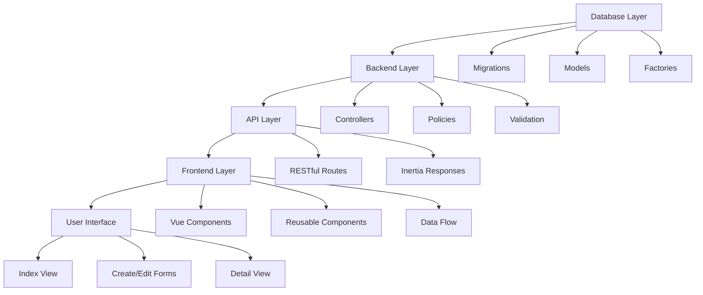
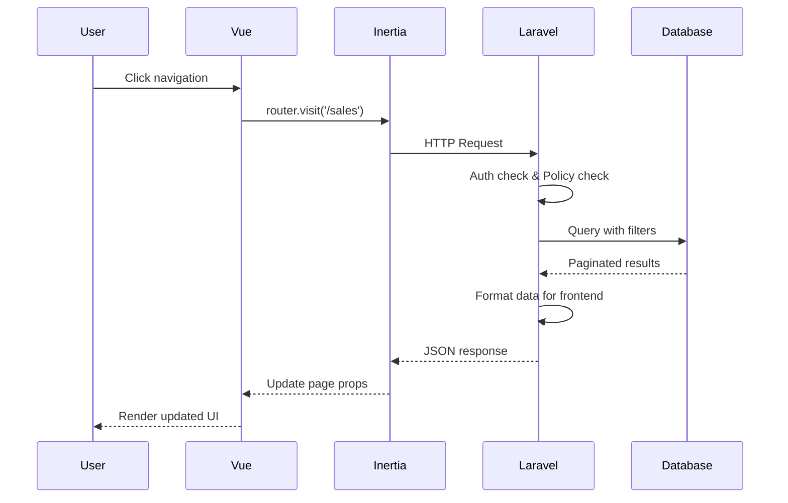

# Sales Module Architecture Documentation

This document provides comprehensive documentation for the sales module architecture, serving as a complete reference guide and template pattern for building similar CRUD modules (expenses, tasks, goals, etc.) in the application.

## Overview

The sales module follows a consistent, scalable architecture pattern built on Laravel + Inertia.js + Vue.js. It implements full CRUD operations with advanced features including search, filtering, sorting, pagination, and role-based permissions.

## Architecture Diagram



## 1. Database Layer

### Schema Structure

The sales table follows a normalized structure with proper indexing for performance:

```sql
-- Primary table structure
CREATE TABLE sales (
    id BIGINT UNSIGNED AUTO_INCREMENT PRIMARY KEY,
    user_id BIGINT UNSIGNED NOT NULL,
    client_id BIGINT UNSIGNED NOT NULL,
    type ENUM('Cards', 'Listings', 'VA', 'Consigned') NOT NULL,
    product_name VARCHAR(255) NOT NULL,
    amount DECIMAL(10,2) NOT NULL,
    sale_date DATE NOT NULL,
    description TEXT,
    status ENUM('pending', 'completed', 'cancelled') DEFAULT 'pending',
    payment_method ENUM('cash', 'card', 'online') DEFAULT 'cash',
    created_at TIMESTAMP DEFAULT CURRENT_TIMESTAMP,
    updated_at TIMESTAMP DEFAULT CURRENT_TIMESTAMP ON UPDATE CURRENT_TIMESTAMP,

    -- Foreign keys
    FOREIGN KEY (user_id) REFERENCES users(id) ON DELETE CASCADE,
    FOREIGN KEY (client_id) REFERENCES users(id) ON DELETE CASCADE,

    -- Performance indexes
    INDEX idx_user_id (user_id),
    INDEX idx_type (type),
    INDEX idx_sale_date (sale_date),
    INDEX idx_status (status),
    INDEX idx_user_date (user_id, sale_date)
);
```

### Migration Files

-   **Initial Migration**: `database/migrations/2025_08_07_082729_create_sales_table.php`
-   **Schema Update**: `database/migrations/2025_08_19_072900_add_missing_fields_to_sales_table.php`

### Model Structure

**File**: `app/Models/Sale.php`

```php
<?php
namespace App\Models;

use Illuminate\Database\Eloquent\Factories\HasFactory;
use Illuminate\Database\Eloquent\Model;

class Sale extends Model
{
    use HasFactory;

    protected $fillable = [
        'user_id',
        'client_id',
        'type',
        'product_name',
        'amount',
        'sale_date',
        'description',
        'status',
        'payment_method',
    ];

    protected $casts = [
        'amount' => 'decimal:2',
        'sale_date' => 'date',
        'status' => 'string',
        'payment_method' => 'string',
    ];

    public function user()
    {
        return $this->belongsTo(User::class);
    }

    public function client()
    {
        return $this->belongsTo(User::class, 'client_id');
    }
}
```

### Factory Pattern

**File**: `database/factories/SaleFactory.php`

```php
public function definition(): array
{
    return [
        'user_id' => User::factory(),
        'client_id' => User::where('role', 'client')->inRandomOrder()->first()->id
                      ?? User::factory()->create(['role' => 'client'])->id,
        'type' => fake()->randomElement(['Cards', 'Listings', 'VA', 'Consigned']),
        'product_name' => fake()->words(3, true),
        'amount' => fake()->randomFloat(2, 10, 10000),
        'sale_date' => fake()->date(),
        'description' => fake()->optional()->sentence(),
        'status' => fake()->randomElement(['pending', 'completed', 'cancelled']),
        'payment_method' => fake()->randomElement(['cash', 'card', 'online']),
    ];
}
```

## 2. Backend Layer

### Controller Architecture

**File**: `app/Http/Controllers/SalesController.php`

The controller implements RESTful methods with advanced filtering and role-based data access:

#### Key Features:

-   **Role-based filtering**: VA users only see their own sales
-   **Advanced search**: Product name, description, status, date range
-   **Data formatting**: Transforms database records for frontend consumption
-   **Statistics endpoint**: Aggregated metrics for dashboards

#### Method Overview:

| Method         | Purpose                   | Authorization    |
| -------------- | ------------------------- | ---------------- |
| `index()`      | List sales with filtering | `viewAny` policy |
| `create()`     | Show create form          | `create` policy  |
| `store()`      | Create new sale           | `create` policy  |
| `show()`       | Display single sale       | `view` policy    |
| `edit()`       | Show edit form            | `update` policy  |
| `update()`     | Update existing sale      | `update` policy  |
| `destroy()`    | Delete sale               | `delete` policy  |
| `statistics()` | Get sales metrics         | `viewAny` policy |

### Validation Rules

**Store Validation**:

```php
$validated = $request->validate([
    'client_id' => 'required|exists:users,id',
    'product_name' => 'required|string|max:255',
    'description' => 'nullable|string',
    'amount' => 'required|numeric|min:0',
    'sale_date' => 'required|date',
    'status' => 'required|in:pending,completed,cancelled',
    'payment_method' => 'required|in:cash,card,online',
    'notes' => 'nullable|string',
]);
```

**Update Validation**:

```php
$validated = $request->validate([
    'client_id' => 'sometimes|required|exists:users,id',
    'product_name' => 'sometimes|required|string|max:255',
    'description' => 'nullable|string',
    'amount' => 'sometimes|required|numeric|min:0',
    'sale_date' => 'sometimes|required|date',
    'status' => 'sometimes|required|in:pending,completed,cancelled',
    'payment_method' => 'sometimes|required|in:cash,card,online',
    'notes' => 'nullable|string',
]);
```

### Authorization Policy

**File**: `app/Policies/SalePolicy.php`

```php
class SalePolicy
{
    public function viewAny(User $user): bool
    {
        return $user->isAdmin() || $user->isManager() || $user->isVA();
    }

    public function view(User $user, Sale $sale): bool
    {
        return $user->isAdmin() || $user->isManager() || $sale->user_id === $user->id;
    }

    public function create(User $user): bool
    {
        return $user->isAdmin() || $user->isManager() || $user->isVA();
    }

    public function update(User $user, Sale $sale): bool
    {
        return $user->isAdmin() || $user->isManager() || $sale->user_id === $user->id;
    }

    public function delete(User $user, Sale $sale): bool
    {
        return $user->isAdmin() || $user->isManager();
    }
}
```

## 3. API Endpoints & Routes

### RESTful Routes

**File**: `routes/web.php`

```php
Route::middleware(['auth', 'verified'])->prefix('sales')->group(function () {
    Route::get('/', [SalesController::class, 'index'])->name('sales.index');
    Route::get('/create', [SalesController::class, 'create'])->name('sales.create');
    Route::post('/', [SalesController::class, 'store'])->name('sales.store');
    Route::get('/{sale}', [SalesController::class, 'show'])->name('sales.show');
    Route::get('/{sale}/edit', [SalesController::class, 'edit'])->name('sales.edit');
    Route::put('/{sale}', [SalesController::class, 'update'])->name('sales.update');
    Route::delete('/{sale}', [SalesController::class, 'destroy'])->name('sales.destroy');
});
```

### Route Pattern

All modules follow the same RESTful pattern:

-   `GET /{module}` - Index/list
-   `GET /{module}/create` - Create form
-   `POST /{module}` - Store new
-   `GET /{module}/{id}` - Show single
-   `GET /{module}/{id}/edit` - Edit form
-   `PUT/P

## 4. Frontend Layer

### Vue Components Architecture

The frontend follows a component-based architecture with clear separation of concerns:

#### Component Structure

```
resources/js/Pages/Sales/
├── Index.vue      # List view with DataTable
├── Create.vue     # Create form
├── Edit.vue       # Edit form
├── Show.vue       # Detail view
```

### Index Component (`resources/js/Pages/Sales/Index.vue`)

**Purpose**: Main listing interface with advanced filtering and search

**Key Features**:

-   **DataTable integration**: Reusable table component
-   **Search & filtering**: Real-time search with debouncing
-   **Pagination**: Server-side pagination with Inertia
-   **Role-based actions**: Conditional buttons based on permissions

**Props Interface**:

```javascript
props: {
    sales: {
        type: Object,
        required: true,
        structure: {
            data: Array,        // Array of sale records
            links: Object,      // Pagination links
            meta: Object        // Pagination metadata
        }
    },
    filters: {
        type: Object,
        default: () => ({})
    }
}
```

### Create/Edit Components

**Create Component** (`resources/js/Pages/Sales/Create.vue`):

-   **Form validation**: Client-side validation with server feedback
-   **Client selection**: Dropdown populated from backend
-   **Default values**: Today's date, pending status
-   **Loading states**: Disable submit during processing

**Edit Component** (`resources/js/Pages/Sales/Edit.vue`):

-   **Pre-populated form**: Existing data loaded via props
-   **Form reuse**: Same structure as create with different submission
-   **Navigation**: Return to detail view after save

### Show Component (`resources/js/Pages/Sales/Show.vue`)

**Purpose**: Detailed view with statistics and actions

**Features**:

-   **Complete record display**: All fields formatted
-   **Statistics cards**: Calculated metrics (days since sale, etc.)
-   **Action buttons**: Edit/Delete with confirmation
-   **Responsive layout**: Grid system for mobile/desktop

## 5. Reusable Components

### DataTable Component (`resources/js/Components/DataTable.vue`)

**Purpose**: Generic table component for all CRUD modules

**Props**:

```javascript
props: {
    data: Array,           // Table data
    columns: Array,        // Column definitions
    filters: Array,        // Filter options
    itemsPerPage: Number   // Pagination size
}
```

**Features**:

-   **Search**: Real-time filtering across all columns
-   **Sorting**: Click column headers to sort
-   **Pagination**: Client-side pagination with navigation
-   **Empty states**: Friendly message when no data
-   **Slot system**: Custom cell rendering via slots

**Column Definition Format**:

```javascript
const columns = [
    { key: "id", label: "ID", sortable: true },
    { key: "product_name", label: "Product", sortable: true },
    { key: "amount", label: "Amount", type: "currency", sortable: true },
    { key: "sale_date", label: "Date", type: "date", sortable: true },
    { key: "status", label: "Status", sortable: true },
];
```

### SearchFilter Component (`resources/js/Components/SearchFilter.vue`)

**Purpose**: Unified search and filter interface

**Features**:

-   **Multiple filter types**: Search, status, date range, amount range
-   **Real-time updates**: Debounced search input
-   **Clear functionality**: Reset all filters
-   **Responsive design**: Mobile-friendly layout

## 6. Data Flow Architecture

### Request Flow



### Data Transformation Pipeline

## 7. Validation Rules & Form Handling

### Server-Side Validation

**Store Rules**:

-   `client_id`: required, exists in users table
-   `product_name`: required, string, max 255 chars
-   `description`: nullable, string
-   `amount`: required, numeric, min 0
-   `sale_date`: required, valid date
-   `status`: required, one of: pending, completed, cancelled
-   `payment_method`: required, one of: cash, card, online

**Update Rules**:

-   Same as store but uses `sometimes|required` for partial updates

### Client-Side Form Handling

**Inertia Form Helper**:

```javascript
const form = useForm({
    client_id: "",
    product_name: "",
    description: "",
    amount: 0,
    sale_date: new Date().toISOString().split("T")[0],
    status: "pending",
    payment_method: "cash",
    notes: "",
});

// Submit with error handling
form.post(route("sales.store"), {
    onSuccess: () => router.visit(route("sales.index")),
    onError: (errors) => console.error(errors),
});
```

### Error Display Pattern

**Component-level error handling**:

```vue
<p v-if="form.errors.field_name" class="mt-1 text-sm text-red-600">
    {{ form.errors.field_name }}
</p>
```

## 8. Permission System

### Role-Based Access Control

**User Roles**:

-   **Admin**: Full access to all operations
-   **Manager**: Full access to all operations
-   **VA**: Can view/create/update own sales, cannot delete

### Policy Implementation

**Gate Usage in Controllers**:

```php
// Before any action
Gate::authorize('viewAny', Sale::class);
Gate::authorize('create', Sale::class);
Gate::authorize('view', $sale);
Gate::authorize('update', $sale);
Gate::authorize('delete', $sale);
```

### Frontend Permission Handling

**Conditional Rendering**:

```javascript
// In Vue components, permissions are handled via:
// 1. Route middleware (automatic redirects)
// 2. Conditional button display
// 3. Error handling for 403 responses
```

## 9. Component Architecture Patterns

### Reusable Patterns

#### 1. CRUD Module Template

Every module follows this exact structure:

**Backend**:

```
app/
├── Models/{ModelName}.php
├── Policies/{ModelName}Policy.php
└── Http/Controllers/{ModelName}Controller.php

database/
├── migrations/xxxx_create_{table}_table.php
└── factories/{ModelName}Factory.php
```

**Frontend**:

```
resources/js/Pages/{ModuleName}/
├── Index.vue
├── Create.vue
├── Edit.vue
└── Show.vue
```

#### 2. DataTable Integration Pattern

**Usage in any module**:

```javascript
// In Index.vue
<DataTable
    :data="items.data"
    :columns="columns"
    :filters="statusFilters"
    @create="createItem"
    @view="viewItem"
    @edit="editItem"
    @delete="deleteItem"
>
    <!-- Custom cell templates -->
    <template #amount="{ item }">
        <span class="font-medium text-green-600">
            ${{ formatCurrency(item.amount) }}
        </span>
    </template>
</DataTable>
```

#### 3. Form Component Pattern

**Create/Edit forms share structure**:

```javascript
// Common form fields
const form = useForm({
    field1: '',
    field2: '',
    // ... other fields
});

// Common validation display
<div>
    <label>Field Label</label>
    <input v-model="form.field" />
    <p v-if="form.errors.field">{{ form.errors.field }}</p>
</div>
```

## 10. Template Guide for New Modules

### Step-by-Step Implementation

#### Step 1: Database Setup

```bash
# 1. Create migration
php artisan make:migration create_expenses_table

# 2. Create model
php artisan make:model Expense -f

# 3. Create policy
php artisan make:policy ExpensePolicy --model=Expense
```

#### Step 2: Migration Template

```php
Schema::create('expenses', function (Blueprint $table) {
    $table->id();
    $table->foreignId('user_id')->constrained()->onDelete('cascade');
    $table->string('title');
    $table->text('description')->nullable();
    $table->decimal('amount', 10, 2);
    $table->date('expense_date');
    $table->enum('category', ['office', 'travel', '

1. **Database Query**: Raw SQL results
2. **Model Formatting**: Laravel collection transformation
3. **Frontend Props**: Structured for Vue components
4. **Component Display**: Formatted for user presentation

### State Management

-   **Server state**: Managed by Laravel/Inertia
-   **Local state**: Vue reactive refs for UI interactions
-   **Form state**: Inertia's useForm helper for validation
```

## 11. Quick Start Template

### Module Generator Script

Create a new module using this template:

```bash
#!/bin/bash
# Usage: ./create-module.sh ModuleName table_name

MODULE_NAME=$1
TABLE_NAME=$2
LOWER_NAME=${MODULE_NAME,,}

# 1. Create migration
php artisan make:migration create_${TABLE_NAME}_table

# 2. Create model with factory
php artisan make:model ${MODULE_NAME} -f

# 3. Create policy
php artisan make:policy ${MODULE_NAME}Policy --model=${MODULE_NAME}

# 4. Create controller
php artisan make:controller ${MODULE_NAME}Controller

# 5. Create Vue pages
mkdir -p resources/js/Pages/${MODULE_NAME}
touch resources/js/Pages/${MODULE_NAME}/{Index.vue,Create.vue,Edit.vue,Show.vue}

echo "Module ${MODULE_NAME} created successfully!"
```

### Migration Template

```php
<?php

use Illuminate\Database\Migrations\Migration;
use Illuminate\Database\Schema\Blueprint;
use Illuminate\Support\Facades\Schema;

return new class extends Migration
{
    public function up(): void
    {
        Schema::create('table_name', function (Blueprint $table) {
            $table->id();
            $table->foreignId('user_id')->constrained()->onDelete('cascade');
            $table->string('title');
            $table->text('description')->nullable();
            $table->decimal('amount', 10, 2)->nullable();
            $table->date('date_field')->nullable();
            $table->enum('status', ['pending', 'completed', 'cancelled'])->default('pending');
            $table->timestamps();

            // Add indexes
            $table->index('user_id');
            $table->index('status');
            $table->index('date_field');
        });
    }

    public function down(): void
    {
        Schema::dropIfExists('table_name');
    }
};
```

### Controller Template

```php
<?php

namespace App\Http\Controllers;

use App\Models\{ModelName};
use Illuminate\Http\Request;
use Illuminate\Support\Facades\{Auth, Gate};
use Inertia\Inertia;

class {ModelName}Controller extends Controller
{
    public function index(Request $request)
    {
        Gate::authorize('viewAny', {ModelName}::class);

        $query = {ModelName}::query();

        // Apply role-based filtering
        if (Auth::user()->role === 'va') {
            $query->where('user_id', Auth::id());
        }

        // Apply search
        if ($request->has('search')) {
            $search = $request->get('search');
            $query->where('title', 'like', "%{$search}%");
        }

        $items = $query->orderBy('created_at', 'desc')
            ->paginate($request->get('per_page', 15));

        return Inertia::render('{ModuleName}/Index', [
            'items' => $items,
            'filters' => $request->only(['search'])
        ]);
    }

    // Implement other CRUD methods following the same pattern
}
```

### Vue Component Templates

#### Index.vue Template

```vue
<template>
    <AuthenticatedLayout>
        <template #header>
            <h2 class="font-semibold text-xl text-gray-800 leading-tight">
                {{ moduleName }} Management
            </h2>
        </template>

        <div class="py-12">
            <div class="max-w-7xl mx-auto sm:px-6 lg:px-8">
                <SearchFilter
                    v-model="filters"
                    :filters="['search', 'status']"
                    :status-options="statusOptions"
                    @apply="applyFilters"
                    @clear="clearFilters"
                />

                <DataTable
                    :data="items.data"
                    :columns="columns"
                    @create="createItem"
                    @view="viewItem"
                    @edit="editItem"
                    @delete="deleteItem"
                />
            </div>
        </div>
    </AuthenticatedLayout>
</template>

<script setup>
// Copy structure from Sales/Index.vue and adapt
</script>
```

## 12. Testing Strategy

### Feature Tests Structure

```php
// tests/Feature/{ModuleName}Test.php
<?php

namespace Tests\Feature;

use App\Models\User;
use Illuminate\Foundation\Testing\RefreshDatabase;
use Illuminate\Foundation\Testing\WithFaker;
use Tests\TestCase;

class {ModuleName}Test extends TestCase
{
    use RefreshDatabase;

    public function test_user_can_view_own_items()
    {
        $user = User::factory()->create(['role' => 'va']);
        $item = {ModelName}::factory()->create(['user_id' => $user->id]);

        $response = $this->actingAs($user)->get('/{module}');

        $response->assertStatus(200);
        $response->assertSee($item->title);
    }

    public function test_admin_can_view_all_items()
    {
        $admin = User::factory()->create(['role' => 'admin']);
        $item = {ModelName}::factory()->create();

        $response = $this->actingAs($admin)->get('/{module}');

        $response->assertStatus(200);
        $response->assertSee($item->title);
    }

    public function test_validation_rules()
    {
        $user = User::factory()->create(['role' => 'va']);

        $response = $this->actingAs($user)->post('/{module}', []);

        $response->assertSessionHasErrors(['title', 'amount', 'date_field']);
    }

    public function test_authorization_rules()
    {
        $user = User::factory()->create(['role' => 'va']);
        $item = {ModelName}::factory()->create(['user_id' => $user->id]);

        $response = $this->actingAs($user)->delete('/{module}/' . $item->id);

        $response->assertStatus(403);
    }
}
```

## 13. Performance Optimization

### Database Optimizations

-   **Indexes**: Strategic indexes on foreign keys and common filters
-   **Eager loading**: Using `with()` to prevent N+1 queries
-   **Pagination**: Server-side pagination for large datasets
-   **Select specific columns**: Avoid `SELECT *` queries

### Frontend Optimizations

-   **Lazy loading**: Components loaded on demand
-   **Debounced search**: 300ms delay on search input
-   **Preserve state**: Inertia's `preserveState` and `preserveScroll`
-   **Component caching**: Reusable DataTable component

### Caching Strategy

```php
// Controller caching example
$sales = Cache::remember("user_{$userId}_sales", 300, function () use ($userId) {
    return Sale::where('user_id', $userId)->get();
});
```

## 14. Security Considerations

### Input Sanitization

-   **SQL injection prevention**: Laravel's query builder
-   **XSS prevention**: Vue's automatic escaping
-   **CSRF protection**: Laravel's CSRF tokens
-   **File upload handling**: Validation and storage security

### Authorization Checks

-   **Policy gates**: Every action checked against policies
-   **Role-based access**: Middleware for route protection
-   **Resource ownership**: Users can only modify own resources
-   **Admin override**: Admins can access all resources

## 15. Deployment Checklist

### Pre-deployment

-   [ ] Run migrations in production
-   [ ] Seed necessary data
-   [ ] Configure environment variables
-   [ ] Set up proper file permissions
-   [ ] Configure queue workers if needed

### Post-deployment

-   [ ] Test all CRUD operations
-   [ ] Verify permissions work correctly
-   [ ] Check performance with production data
-   [ ] Monitor error logs
-   [ ] Set up automated backups

## 16. Common Issues & Solutions

### Issue: "Class not found" errors

**Solution**: Run `composer dump-autoload`

### Issue: Policy not working

**Solution**: Register policy in `AuthServiceProvider`

### Issue: Vue components not updating

**Solution**: Run `npm run build` for production

### Issue: Database connection errors

**Solution**: Check `.env` database configuration

## 17. Extension Points

### Adding New Fields

1. Create migration for new column
2. Update model's `$fillable` array
3. Update validation rules
4. Update Vue components
5. Update factory for testing

### Adding New Features

-   **Bulk operations**: Add to DataTable component
-   **Export functionality**: Add controller method
-   **Advanced filtering**: Extend SearchFilter component
-   **Real-time updates**: Implement Laravel Echo

## 18. Code Standards

### Naming Conventions

-   **Models**: PascalCase (e.g., `Sale`, `Expense`)
-   **Controllers**: PascalCase + Controller suffix
-   **Routes**: kebab-case (e.g., `sales.index`)
-   **Vue components**: PascalCase (e.g., `SalesIndex`)

### File Organization

```
app/
├── Models/
├── Http/Controllers/
├── Policies/
└── Http/Requests/

resources/js/
├── Pages/{ModuleName}/
├── Components/
└── Utils/
```

### Code Style

-   **PSR-12** for PHP code
-   **Vue Style Guide** for Vue components
-   **Consistent indentation**: 4 spaces
-   **Meaningful variable names**

## Conclusion

This sales module architecture provides a robust, scalable foundation for building CRUD modules in the application. By following these patterns and templates, developers can quickly implement new modules with consistent behavior, security, and user experience.

The modular approach ensures:

-   **Consistency** across all modules
-   **Maintainability** through clear separation of concerns
-   **Scalability** with reusable components
-   **Security** through proper authorization
-   **Performance** with optimized queries

Use this documentation as a reference when implementing new modules like expenses, tasks, goals, or any other CRUD functionality in the application.

```php
public function test_user_can_create_item()
{
    $user = User::factory()->create(['role' => 'va']);

    $response = $this->actingAs($user)->post('/items', [
        'title' => 'Test Item',
        'description' => 'Test description',
        'amount' => 100.00,
        'date_field' => now()->toDateString(),
        'status' => 'pending',
        'category' => 'office',
    ]);

    $response->assertRedirect('/items');
    $this->assertDatabaseHas('items', [
        'title' => 'Test Item',
        'description' => 'Test description',
        'amount' => 100.00,
        'date_field' => now()->toDateString(),
        'status' => 'pending',
        'category' => 'office',
        'user_id' => $user->id,
    ]);
}
```
